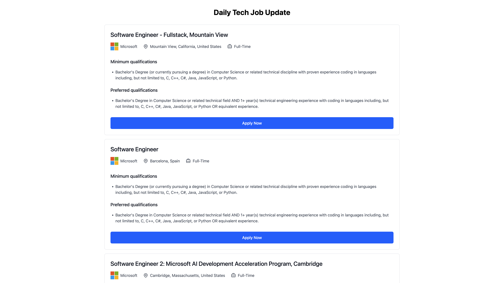

# Job Board Application

Stop going to every big tech company's careers page to find your next dream job.
This app collects all the latest job listings from big tech companies every day.


## 🚀 Features

- Browse big tech job listings
- Responsive design
- Daily updates with Supabase
- TypeScript support

## 🛠️ Tech Stack

- **Frontend Framework:** Next.js 13+
- **Language:** TypeScript
- **Database:** Supabase
- **Styling:** CSS Modules/Tailwind CSS (adjust based on your setup)

## 📦 Installation

1. **Clone the repository**
   ```bash
   git clone <your-repository-url>
   cd Daily-Tech-Job-Update
   ```

2. **Install dependencies**
   ```bash
   npm install
   # or
   yarn install
   ```

3. **Run the development server**
   ```bash
   npm run dev
   # or
   yarn dev
   ```

4. Open [http://localhost:3000](http://localhost:3000) in your browser

## 📁 Project Structure
```
├── app/
│ └── page.tsx # Main page component
├── components/
│ └── JobCard.tsx # Job listing card component
├── public/
│ └── images/ # Static assets
├── .env.local # Environment variables
├── tsconfig.json # TypeScript configuration
└── package.json # Project dependencies
```

## 🔧 Configuration

The project uses TypeScript for type safety. Configuration can be found in `tsconfig.json`.

## 📝 License

This project is licensed under the MIT License - see the [LICENSE](LICENSE) file for details.

## 👥 Authors

- Elliot Lin - Initial work

## 🙏 Acknowledgments

- Next.js team for the amazing framework
- Supabase team for the backend infrastructure
